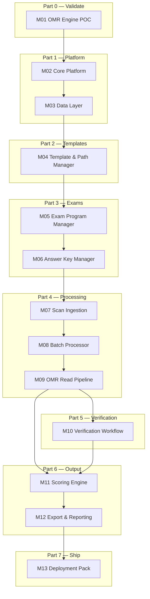

# On-Premises OMR Processing System — Build Context

> Consolidated implementation plan for the ABBYY replacement OMR system.  
> Workspace: `/Users/aaz/.cursor/OCRAPP` (greenfield).

## Context

- **Inputs confirmed**: sample scans/coordinate maps available; **Windows** is the operator machine; **Secure Score** = confirmed score excluding ambiguous **Blank** and **Multi** responses (not per-wrong-answer penalty marking).
- **Scale target**: ~100 sheets/batch, ≤1.5 s/page, fully offline.
- **FR-1.3 clarified**: question blocks are **variable size** (15, 20, 30, 40, etc.) — not fixed at 30. Recurring **exam programs** use **cumulative global question numbers** across sessions; each session gets its own **path layout** and scores against a **slice** of one shared master answer key that **grows incrementally** as each session is configured.
- **Template inputs now confirmed**: one **150-question template image** is available and should be used as the baseline calibration artifact; a **60-question template** also exists but sample image/file is still pending.
- **150Q physical layout confirmed**: 5 columns × 30 questions (Q1–30, Q31–60, … Q121–150). Partial sessions fill **column-by-column in order** — e.g., 20-Q exam = Q1–Q20 in column 1 only; next 30-Q session = Q21–Q50 (rows 21–30 of col 1 + all of col 2).
- **Roll number source confirmed**: **bubble grid only** (6-digit matrix). Barcode on sheet is ignored.

---

## Build Parts & Modules

The system is split into **7 build parts** (deliverable milestones) composed of **12 software modules**. Build in dependency order — each part unlocks the next.



### Part 0 — OMR Validation (go/no-go gate)

| Module | Path | Responsibility | PRD |
|--------|------|----------------|-----|
| **M01 OMR Engine POC** | `backend/omr_engine/` (vendored), `samples/isra_150q/` | Clone [udayraj123/OMRChecker](https://github.com/udayraj123/OMRChecker); author Isra 150Q `template.json` (5×30 MCQ + 6-digit roll); run on blank + 10–20 filled scans; record accuracy % | FR-2.2, FR-2.3 |

**Exit criteria:** ≥90% auto-read on roll + MCQ without override (tune on Canon scans); alignment works on tilted scans.

---

### Part 1 — Platform Foundation

| Module | Path | Responsibility | PRD |
|--------|------|----------------|-----|
| **M02 Core Platform** | `backend/app/main.py`, `config.py`, `config.yaml`, `frontend/`, `scripts/run_windows.bat` | FastAPI + Uvicorn shell; React/Vite shell; static file serving; health endpoint; Windows launcher | — |
| **M03 Data Layer** | `backend/app/db/` | SQLAlchemy models, SQLite init, migrations; all tables below; session factory | — |

**Tables owned by M03:** `exam_programs`, `path_layouts`, `exam_sessions`, `answer_keys`, `answer_key_audit`, `subject_splits`, `scan_batches`, `sheet_results`, `verification_queue`, `ingested_files`

---

### Part 2 — Template & Path Management

| Module | Path | Responsibility | PRD |
|--------|------|----------------|-----|
| **M04 Template & Path Manager** | `backend/app/api/templates.py`, `backend/app/services/template_service.py`, `frontend/src/pages/LayoutCalibrator.tsx` | Store OMRChecker `template.json` per path layout; template-family registry (`150Q`/`60Q`); calibrator UI to generate/edit templates; template mismatch validation on batch start | FR-1.3 |

**Key logic:**
- One calibrated template per template family (150Q = 5×30 grid + roll block).
- Session selects template family + path; `global_q_start`/`global_q_end` slice which field blocks to read.
- 60Q family added when sample arrives (same roll/anchor, different answer grid).

---

### Part 3 — Exam & Answer Key Management

| Module | Path | Responsibility | PRD |
|--------|------|----------------|-----|
| **M05 Exam Program Manager** | `backend/app/api/programs.py`, `backend/app/api/sessions.py`, `frontend/src/pages/ExamProgramSetup.tsx` | Create exam programs; session chain with cumulative global Q numbering; auto-suggest `global_q_start`; subject split ranges; key coverage map UI | FR-1.1, FR-1.4 |
| **M06 Answer Key Manager** | `backend/app/services/answer_key_parser.py`, `backend/app/api/answer_keys.py` | Incremental master key slices per session; CSV/Excel upload; manual grid entry; upsert by global `question_no`; audit trail; block scan if slice incomplete | FR-1.2 |

**Key logic:**
- Master key grows: Session 1 → Q1–Q20, Session 2 → merge Q21–Q50, etc.
- Scoring always reads slice `[global_q_start, global_q_end]` from program master key.

---

### Part 4 — Scan Ingestion & Processing

| Module | Path | Responsibility | PRD |
|--------|------|----------------|-----|
| **M07 Scan Ingestion** | `backend/app/watcher/dropzone.py` | Watch `C:\OMR_Dropzone\`; accept JPG/TIFF/PDF; SHA-256 dedup; `.omr_lock` wait; enqueue pages to active batch | FR-2.1 |
| **M08 Batch Processor** | `backend/app/services/batch_processor.py`, WebSocket routes | Multiprocessing sheet queue; progress %; pause on verification queue; tie jobs to `scan_batch` + `exam_session` | FR-2.1 |
| **M09 OMR Read Pipeline** | `backend/app/omr/pipeline.py`, `align.py`, `roll_number.py`, `bubbles.py`, `threshold.py` | Wrap OMRChecker engine; CropOnMarkers alignment; roll decode (bubbles only); MCQ read with dynamic threshold (open-mcr idea); blank/multi flagging; session Q-range filter; save anomaly crops | FR-2.2, FR-2.3, FR-3.1 |

**Internal sub-modules within M09:**

| Sub-module | File | Does |
|------------|------|------|
| Align | `omr/align.py` | Corner bullseye detection + perspective warp (OMRChecker `CropOnMarkers`) |
| Roll | `omr/roll_number.py` | 6-column × 10-row bubble matrix decode |
| Bubbles | `omr/bubbles.py` | Per-question A/B/C/D fill density; blank/multi detection |
| Threshold | `omr/threshold.py` | Dynamic fill threshold (reimplemented from open-mcr concept) |
| Pipeline | `omr/pipeline.py` | Orchestrate: image → align → read active Q range → anomalies |

---

### Part 5 — Verification Workflow

| Module | Path | Responsibility | PRD |
|--------|------|----------------|-----|
| **M10 Verification Workflow** | `backend/app/api/verification.py`, `backend/app/hotkeys/listener.py`, `frontend/src/pages/VerificationQueue.tsx` | Anomaly queue; crop image viewer; pynput global `L` key → WebSocket → focus override; values A/B/C/D/Blank; show Sheet Q + Global Q; Skip / Flag / Confirm | FR-3.2 |

**Flow:** anomaly detected → pause batch → operator presses `L` → types override → Enter commits → resume.

---

### Part 6 — Scoring & Export

| Module | Path | Responsibility | PRD |
|--------|------|----------------|-----|
| **M11 Scoring Engine** | `backend/app/services/scoring.py` | Correct/wrong/blank/multi counts; Percentage %; Secure Score (excludes blank/multi from denominator) | FR-4.2 |
| **M12 Export & Reporting** | `backend/app/services/export.py`, `frontend/src/pages/ExportReport.tsx` | CSV/Excel export; binary (1/0) vs literal (A/B/C/D/Blank/Multi) modes; per-session and cumulative program export; subject-wise column regeneration | FR-4.1, FR-4.2, FR-4.3 |

---

### Part 7 — Deployment

| Module | Path | Responsibility | PRD |
|--------|------|----------------|-----|
| **M13 Deployment Pack** | `scripts/run_windows.bat`, `docs/canon_setup.md`, nightly backup script | Windows venv + start script; Canon DR-M140 folder config; `omr.db` backup; acceptance test checklist | — |

---

### Module → API surface (summary)

| Module | Key endpoints / interfaces |
|--------|---------------------------|
| M04 | `GET/POST /api/templates`, `POST /api/templates/validate` |
| M05 | `GET/POST /api/programs`, `GET/POST /api/programs/{id}/sessions` |
| M06 | `GET/POST /api/programs/{id}/answer-keys`, `POST /api/answer-keys/upload` |
| M07 | Internal watcher → job queue (no REST) |
| M08 | `POST /api/batches/start`, `WS /ws/batch/{id}` |
| M09 | Called by M08 internally; `POST /api/omr/process-page` (debug) |
| M10 | `GET /api/verification/queue`, `PATCH /api/verification/{id}`, `WS /ws/hotkeys` |
| M11 | Called by M08/M12 internally |
| M12 | `GET /api/exports/{session_id}`, `POST /api/exports/regenerate` |

---

### Build order checklist (by part)

| Part | Modules | Depends on | Est. |
|------|---------|------------|------|
| **0** | M01 | — | 2–3 days |
| **1** | M02, M03 | M01 pass | 2–3 days |
| **2** | M04 | M01, M03 | 3–4 days |
| **3** | M05, M06 | M03, M04 | 4–5 days |
| **4** | M07, M08, M09 | M01, M03, M05, M06 | 5–6 days |
| **5** | M10 | M08, M09 | 3–4 days |
| **6** | M11, M12 | M05, M06, M09, M10 | 3–4 days |
| **7** | M13 | All above | 1–2 days |

**Total estimate:** ~4–5 weeks for v1 (150Q family).

---

## FR-1.3 — Variable Blocks + Exam Series Model

Physical OMR sheets vary in question count per sitting. A recurring exam program (e.g., weekly tests for one batch) accumulates questions across sessions:

| Session | Sheet questions | Global Q range | Path layout | Master key action |
|---------|-----------------|----------------|-------------|-------------------|
| Exam 1 | 20 | Q1–Q20 | `Path_20Q_v1` (new) | **Add** answers Q1–Q20 |
| Exam 2 | 30 | Q21–Q50 | `Path_30Q_v1` (new) | **Add** answers Q21–Q50 |
| Exam 3 | 10 | Q51–Q60 | reuse `Path_20Q_v1` or new | **Add** answers Q51–Q60 |

**Rules:**
- Each unique sheet format (question count + bubble positions) creates a **new path layout** via the calibrator — stored permanently for reuse.
- Reusing an existing format (e.g., another 20-Q exam later) selects an existing path; no re-mapping.
- Treat `150Q` and `60Q` as separate **template families** with independent path sets; never reuse coordinates across families unless explicitly revalidated.
- **Master answer key** lives at the **program** level and is **built in parts** — you do not need the full key upfront.
- **Session 1 setup**: enter/upload answers for Q1–Q20 only → master key now covers Q1–Q20.
- **Session 2 setup**: system suggests Q21–Q50 (or Q21–Q30 if sheet has 10 questions); enter/upload that slice → master key **merges** Q21–Q50 into the same program record.
- Each session scores only against its slice; prior sessions' keys remain unchanged unless explicitly edited.
- On new session setup, system **auto-suggests** `global_q_start = previous_session.global_q_end + 1`.
- **Column-order mapping (150Q)**: questions traverse columns left-to-right, 30 per column. Global Q maps to `(column, row)` via: `column = floor((global_q − 1) / 30) + 1`, `row = ((global_q − 1) % 30) + 1`. Session scoring activates only bubbles in `[global_q_start, global_q_end]`; other printed bubbles are ignored.
- Verification UI shows **both** sheet-printed number and global number (e.g., `Sheet Q14 → Global Q34`).
- All sessions, paths, and key slices are tracked in SQLite for audit and reuse.

### Incremental master key workflow

**Key entry methods per slice** (same as FR-1.2):
- CSV/Excel upload scoped to the session's global range (e.g., rows with `question_no` 21–50).
- Manual grid UI showing only the current session's question range.
- Optional: upload a partial file at any time; system upserts by global `question_no`.

**Guardrails:**
- Scanning/processing for a session is **blocked** until every question in that session's `[global_q_start, global_q_end]` range has an answer in the master key.
- UI shows **key coverage map**: filled vs missing ranges across the program (e.g., "Q1–Q20 ✓ | Q21–Q50 pending").
- Editing an earlier slice (e.g., fix Q5) is allowed; changes apply retroactively to exports for that session if re-exported — logged in an audit trail.

### Template-family handling (150Q now, 60Q pending)

- Add a `template_family` attribute to each path layout and session (`150Q` or `60Q`).
- During batch setup, operator must choose the template family first, then select a compatible path.
- Add lightweight first-page validation:
  - verify expected bubble-row count for selected family,
  - verify key anchor geometry tolerance.
- If validation fails, batch is paused with a "template mismatch" error and operator must switch family or recalibrate.
- Initial implementation ships with `150Q` calibration based on provided sample image; `60Q` calibration is added as soon as the sample sheet is supplied.
- For 60Q: Roll No. and corner anchors stay in the same physical positions as 150Q; only the answer-grid area differs.

---

## Open-Source OMR Comparison (Research)

Three repos evaluated against the Isra University sheet and PRD requirements.

### Summary table

| | [udayraj123/OMRChecker](https://github.com/udayraj123/OMRChecker) | [iansan5653/open-mcr](https://github.com/iansan5653/open-mcr) | [ZahraArshia/OMRChecker](https://github.com/ZahraArshia/OMRChecker) |
|---|---|---|---|
| **Stars / activity** | ~1.1k stars, active (v1.1.0 2024) | ~208 stars, maintained | 1 star, stale since 2023 |
| **License** | MIT | GPL-3.0 | GPL-3.0 |
| **Sheet model** | **Custom** via `template.json` field blocks | **Fixed** OpenMCR PDF only (75Q/150Q) | Fork of udayraj123 |
| **Alignment** | Corner marker template matching (`CropOnMarkers`) | L-mark + square reference geometry | Same as udayraj123 |
| **Roll number** | `QTYPE_INT` bubble grids in template | Name/ID letter/number grids (fixed layout) | Same as udayraj123 |
| **MCQ reading** | `QTYPE_MCQ4` blocks with origins + gaps | Grid cells with dynamic fill threshold | Same as udayraj123 |
| **Multi-column layout** | Yes — multiple `fieldBlocks` at different origins | Fixed column structure in `grid_info.py` | Same as udayraj123 |
| **UI** | CLI only | Tkinter GUI + Windows `.exe` installer | CLI only |
| **Batch / watcher** | Manual folder input | Manual folder/GUI pick | Manual folder input |
| **Verification workflow** | None | None | None |
| **Exam series / incremental key** | None | None | None |
| **Fit for Isra 150Q sheet** | **High** — corner bullseyes + 5×30 columns map to field blocks | **Low** — wrong sheet geometry entirely | **Same as udayraj** but use upstream |

### Per-repo notes

**[udayraj123/OMRChecker](https://github.com/udayraj123/OMRChecker)** — **Recommended engine foundation**

- `template.json` defines `fieldBlocks` with `origin`, `bubblesGap`, `labelsGap`, and types like `QTYPE_MCQ4` and `QTYPE_INT` — maps directly to the Isra sheet:
  - 6-digit roll grid → `Roll` block with `roll1..6`
  - 5 columns × 30 questions → five `MCQ_Block` entries (e.g. `q1..30`, `q31..60`, …)
  - Corner bullseye alignment → `CropOnMarkers` preprocessor (template matching, homography warp)
- Claims ~200 sheets/min, ~100% on good scanner output — exceeds the 1.5 s/page target.
- MIT license — safe to embed/adapt in the on-prem product.
- **Missing from PRD** (still build): web UI, file watcher, L-key verification, exam program/series, incremental master key, subject splits, Secure Score.

**[iansan5653/open-mcr](https://github.com/iansan5653/open-mcr)** — borrow algorithms, not the project

- Mature Windows desktop app with installer — closest to "operator desk" UX, but locked to **its own printable sheet** (not the Isra template).
- Alignment uses L-shaped + square corner marks — different from bullseye corners; would not work on Isra sheets without rewrite.
- **Worth borrowing**: `calculate_bubble_fill_threshold()` in `grid_reading.py` — dynamically finds fill threshold from bubble histogram rather than fixed 0.35 constant.
- **Worth borrowing**: circle-masked fill percentage per bubble (reduces border noise).
- GPL-3.0 — avoid embedding code directly; reimplement ideas only.

**[ZahraArshia/OMRChecker](https://github.com/ZahraArshia/OMRChecker)** — skip

- Explicit fork of udayraj123 with minor modifications; acknowledges Udayraj as original author.
- Stale (last push 2023), 1 star, no meaningful divergence from upstream.
- Use [udayraj123/OMRChecker](https://github.com/udayraj123/OMRChecker) directly instead.

### Recommended integration strategy

- **Reuse from udayraj123 OMRChecker (MIT):** `CropOnMarkers` alignment, `template.json` field blocks, bubble read + scoring core.
- **Borrow ideas from open-mcr:** dynamic fill threshold, circle-masked fill %.
- **Build custom for PRD:** FastAPI + React, exam program/series, L-key verification queue, Canon dropzone watcher.

**Phase 0 (before full scaffold):** Run udayraj123 OMRChecker against the Isra 150Q blank scan. Author a `template.json` for the 5×30 layout + 6-digit roll grid. Validate auto-read accuracy on 10–20 filled samples. This is the go/no-go gate.

**Path layout storage:** Store OMRChecker-compatible `template.json` in `path_layouts.columns_json` (or as a file reference). Calibrator UI can generate this JSON visually instead of raw coordinate clicks.

---

## Recommended Architecture

| Layer | Choice | Rationale |
|-------|--------|-----------|
| Backend | **FastAPI** + Uvicorn | Async batch jobs, REST + WebSocket for live progress, serves built frontend |
| OMR engine | **udayraj123/OMRChecker** (MIT, vendored as `backend/omr_engine/`) | Proven custom-template OMR; `CropOnMarkers` fits Isra bullseyes; `template.json` maps to 5×30 columns |
| Thresholding | Dynamic fill threshold (idea from [open-mcr](https://github.com/iansan5653/open-mcr)) | Adapts per-sheet to pencil/pen/lighting; reimplement, don't copy GPL code |
| Hotkeys | **pynput** | Global `L` key capture on Windows (avoids browser/OS shortcut conflicts) |
| DB | **SQLite** + SQLAlchemy | Offline, zero ops, fits config + results |
| Frontend | **React + Vite + TypeScript** | Rich calibrator UI, global `L` hotkey handler, image crop viewer |
| File watch | **watchdog** | Cross-platform API; default path `C:\OMR_Dropzone\` on Windows |
| PDF/TIFF | **pdf2image** + Pillow | Canon bulk output formats |
| Export | **pandas** + **openpyxl** | CSV/Excel with subject columns |

**Deployment**: single `run.bat` starts Uvicorn on `127.0.0.1:8080`; operator opens browser locally. No cloud calls, no telemetry.

---

## Project Layout (to create)

```
OCRAPP/
├── backend/
│   ├── app/
│   │   ├── main.py                 # FastAPI entry, static mount
│   │   ├── config.py               # dropzone path, thresholds
│   │   ├── db/                     # SQLAlchemy models + session
│   │   ├── api/                    # REST routes
│   │   ├── omr/
│   │   ├── hotkeys/
│   │   ├── services/
│   │   └── watcher/
│   ├── omr_engine/                 # vendored udayraj123 OMRChecker
│   ├── requirements.txt
│   └── alembic/
├── frontend/
│   └── src/
│       ├── pages/ExamProgramSetup.tsx
│       ├── pages/LayoutCalibrator.tsx
│       ├── pages/VerificationQueue.tsx
│       └── pages/ExportReport.tsx
├── samples/
├── data/omr.db
├── config.yaml
└── scripts/run_windows.bat
```

---

## Database Schema

| Table | Key fields |
|-------|------------|
| `exam_programs` | `id`, `name`, `planned_max_questions`, `key_coverage_end`, `description` |
| `path_layouts` | `id`, `template_family` (`150Q`/`60Q`), `name`, `max_questions`, `columns_json`, `roll_number_json`, `anchor_json`, `created_at` |
| `exam_sessions` | `id`, `program_id`, `template_family`, `session_order`, `name`, `path_layout_id`, `sheet_question_count`, `global_q_start`, `global_q_end`, `key_complete`, `exam_date`, `batch_name`, `export_mode` |
| `answer_keys` | `program_id`, `question_no` (global), `correct_option`, `added_via_session_id`, `updated_at` |
| `answer_key_audit` | `program_id`, `question_no`, `old_value`, `new_value`, `changed_by`, `changed_at` |
| `subject_splits` | `program_id` or `session_id`, `subject_name`, `q_start`, `q_end` |
| `scan_batches` | `session_id`, `status`, `progress_pct`, `started_at` |
| `sheet_results` | `batch_id`, `roll_no`, `answers_json`, `counts_json` |
| `verification_queue` | `sheet_id`, `global_question_no`, `anomaly_type`, `crop_path`, `detected_values`, `resolved_value`, `status` |
| `ingested_files` | `file_hash`, `filename`, `session_id`, `processed_at` |

---

## Implementation Phases (maps to build parts)

| Phase | Build Part | Modules |
|-------|------------|---------|
| Phase 0 | Part 0 — OMR Validation | M01 |
| Phase 1 | Part 1 — Platform + Part 2 start | M02, M03, M04 |
| Phase 2 | Part 2 finish + Part 4 OMR | M04, M09 |
| Phase 3 | Part 3 — Exams | M05, M06 |
| Phase 4 | Part 4 — Ingestion | M07, M08 |
| Phase 5 | Part 5 — Verification | M10 |
| Phase 6 | Part 6 — Export | M11, M12 |
| Phase 7 | Part 7 — Deploy | M13 |

### Phase 0 — OMR POC (Part 0, M01)
- Calibrate udayraj123 `template.json` on Isra 150Q blank.
- Benchmark 10–20 filled scans for accuracy go/no-go.

### Phase 1 — Foundation + Calibration (Week 1)
- Scaffold FastAPI + React + SQLite.
- Path layout calibrator UI (generates OMRChecker `template.json`).
- Seed `config.yaml` with thresholds and dropzone path.

### Phase 2 — OMR Engine (Week 2)
- Integrate OMRChecker core with session Q-range slicing.
- Roll number decode, bubble fill analysis, blank/multi flagging.
- Dynamic threshold from open-mcr ideas.

### Phase 3 — Exam Program + Session Management (Week 2–3)
- Exam program page with incremental master key slices.
- Session chain with global Q numbering.
- Subject splits UI.

### Phase 4 — Ingestion + Batch Processing (Week 3)
- Dropzone watcher with hash dedup and lock files.
- Multiprocessing batch processor with WebSocket progress.

### Phase 5 — Verification Workflow (Week 3–4)
- Verification queue with pynput global `L` key.
- Crop viewer, override input, Skip/Flag/Confirm actions.

### Phase 6 — Scoring + Export (Week 4)
- Secure Score, binary/literal export modes.
- Subject-wise report regeneration.

### Phase 7 — Windows Deployment + Hardening
- `run_windows.bat`, Canon DR-M140 docs, acceptance tests.

---

## Scoring Rules

| Metric | Rule |
|--------|------|
| Correct | single answer matches key |
| Wrong | single answer ≠ key |
| Blank | no bubble / operator Blank |
| Multi | multi-bubble / operator unresolved multi |
| Percentage (%) | `correct / session_question_count × 100` |
| **Secure Score** | `correct / (total − blank − multi) × 100`; if denominator 0 → 0 |

---

## Implementation Order (Suggested PRs)

0. OMR POC — udayraj123 template.json on Isra 150Q blank + accuracy benchmark
1. Scaffold + DB + config
2. Vendor OMRChecker core + Isra 150Q template
3. Wrap engine in FastAPI — session Q-range slicing, anomaly flagging
4. Exam program/session APIs + master key UI
5. Dropzone watcher + batch processor
6. Verification queue + L-key UI
7. Export + subject-wise reporting
8. 60Q template family — when sample provided

---

## Risks and Mitigations

| Area | Risk | Mitigation |
|------|------|------------|
| Image preprocessing | Poor scan quality | Otsu binarization + morphological cleanup; dynamic threshold |
| Hotkey focus | `L` conflicts with OS shortcuts | pynput global listener on Windows |
| Modular grids | Variable block sizes + series continuity | `path_layouts` + `exam_sessions` chain |
| Series numbering | Gap/overlap across sessions | Auto-suggest `global_q_start`; validate on create |
| Incremental key | Missing answers for new slice | Block scan until slice complete |
| Performance | 1.5 s/sheet target | NumPy vectorization + multiprocessing |
| File watcher | Duplicates, partial scans | SHA-256 dedup + `.omr_lock` sidecar |
| Accuracy vs ABBYY | Unknown read rate | Phase 0 POC benchmark before full build |

---

## Build Inputs Still Needed

- 1 blank/template sheet for **150Q** (received)
- 1 blank/template sheet for **60Q** (pending)
- 2–3 filled sheets (including smudges/multi-mark)
- Any existing ABBYY coordinate export (optional, speeds calibration)

Development can proceed on macOS; validation and threshold tuning must happen on the Windows operator PC with the Canon scanner.

---

## Implementation Todos (by module)

### Part 0
- [x] **M01** — OMR Engine POC: vendored OMRChecker, `template.json`, alignment pass on blank *(bubble coords + filled-scan benchmark still pending)*

### Part 1
- [x] **M02** — Core Platform: FastAPI + React shell + `config.yaml` + Windows run script
- [x] **M03** — Data Layer: SQLAlchemy models + SQLite init for all tables

### Part 2
- [x] **M04** — Template & Path Manager: engine-backed calibrator UI (warped-page overlay), template-family registry (`150Q`/`60Q`), path-layout CRUD + auto-seed, session mismatch validation. Headless-safe engine import (guarded `screeninfo`). *(Coordinate fine-tuning + 60Q sample still data-dependent.)*

### Part 3
- [x] **M05** — Exam Program Manager: programs + session chain with auto cumulative global Q numbering, overlap/family validation, subject splits, answer-key coverage map, full `ExamProgramSetup.tsx` UI
- [x] **M06** — Answer Key Manager: incremental master key (upsert by global `question_no`), CSV/Excel upload + manual grid scoped to session slice, range enforcement, audit trail, per-session readiness gating, UI in `ExamProgramSetup.tsx`

### Part 4
- [x] **M07** — Scan Ingestion: `watcher/dropzone.py` + `handler.py`, SHA-256 dedup, `.omr_lock`/size-stable wait, PDF→page expansion, debounced auto-flush to active session, `ingestion` control API
- [x] **M08** — Batch Processor: `services/batch_processor.py`, background-thread batch run, progress %, key-completeness guardrail, `SheetResult` + `verification_queue` persistence, `batches` API + `WS /api/ws/batch/{id}` progress
- [x] **M09** — OMR Read Pipeline: `omr/align.py` (warp→pageDimensions), `threshold.py` (dynamic gap threshold), `bubbles.py` (MCQ blank/multi), `roll_number.py` (6-digit, bubbles only), `pipeline.py` (global Q mapping + anomaly crops). *(Read accuracy pending calibrated coords + real filled scans.)*

### Part 5
- [x] **M10** — Verification Workflow: `verification_service.py` (resolve override → SheetResult + recount, batch finalize), `api/verification.py` (queue/detail/resolve/crop image + `WS /api/ws/verification`), `hotkeys/listener.py` (guarded global `L`-key → WS fan-out, start/stop/status), `VerificationQueue.tsx` (crop viewer, A/B/C/D/Blank override, keyboard shortcuts, Confirm/Skip/Flag). Fixed autoflush staleness in batch finalize.

### Part 6
- [x] **M11** — Scoring Engine: `scoring.py` — per-question correct/wrong/blank/multi, Percentage (`correct/total`), Secure Score (`correct/(total−blank−multi)`, 0 if denom≤0), subject-split sub-scores; `/sessions/{id}/scores`
- [x] **M12** — Export & Reporting: `export.py` — per-session + cumulative-program tables, literal (A/B/C/D/Blank/Multi) & binary (1/0) modes, subject columns, CSV + Excel; `/sessions/{id}/export`, `/programs/{id}/export`; `ExportReport.tsx` (scope/mode/format, score preview, download)

### Part 7
- [x] **M13** — Deployment Pack: hardened `scripts/run_windows.bat` (prereq checks, folder/dropzone setup, auto-open browser), `scripts/backup_db.bat` (nightly timestamped backup + 30-day prune + Task Scheduler note), `docs/canon_setup.md` (DR-M140 profile + dropzone), `docs/deployment.md` (install/run/config/backup/troubleshoot), `docs/acceptance_tests.md` (FR-mapped checklist)
- [ ] **M04 extension** — 60Q template family when sample provided
- [x] **M14** — Windows .exe packaging: frozen-aware `app/paths.py` (single source for resource vs writable dirs; `sys._MEIPASS` vs exe-parent), refactored `config.py`/`template_service.py`/`batch_processor.py`/`watcher/dropzone.py` through it, `backend/desktop.py` entry point (programmatic uvicorn + browser open + `freeze_support`), `backend/omr.spec` (one-folder; `collect_all` for engine deps matplotlib/rich/jsonschema/screeninfo/dotmap/deepmerge/pandas + uvicorn/pynput-win32/websockets hidden imports; bundles frontend/dist, samples, config.yaml, omr_engine), `backend/requirements-build.txt` (pyinstaller), `scripts/build_exe.bat`, deployment-doc §8. Writable `data\` sits next to exe; optional `config.yaml` next to exe overrides bundled default. *(Build/test must run on the Windows machine — PyInstaller is not a cross-compiler.)*
